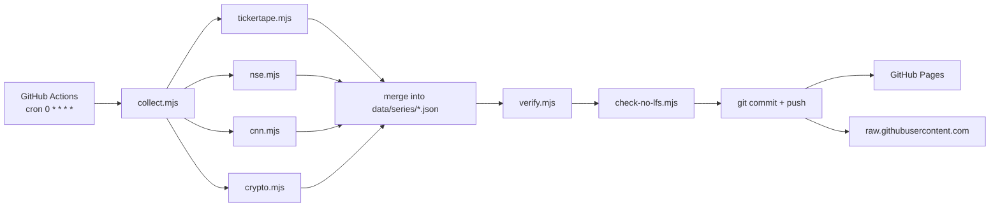

# Fear & Greed Index API

> Free static JSON API for market fear & greed — 80 series from four independent sources, collected hourly by GitHub Actions, served from GitHub Pages and `raw.githubusercontent.com`. Zero dependencies, zero servers, zero cost.

[](./LICENSE)
[](https://github.com/chirag127/fear-greed-index-api/actions/workflows/scrape.yml)
[](https://github.com/chirag127/fear-greed-index-api/actions/workflows/deploy.yml)

## What it is

An open, cacheable dataset for market sentiment and valuation — the sort of thing usually locked behind a
paid terminal. It merges:

| Source | What it contributes |
| --- | --- |
| [Tickertape MMI](https://www.tickertape.in/market-mood-index) | India's 0–100 Market Mood Index + the Nifty level it was computed against |
| [CNN Fear & Greed](https://edition.cnn.com/markets/fear-and-greed) | US composite plus all **nine** sub-indicators, 252 trading days |
| [alternative.me](https://alternative.me/crypto/fear-and-greed-index/) | Crypto Fear & Greed, **full history since 2018-02-01** |
| NSE (`allIndices`, `fiidiiTradeReact`) | P/E, P/B and dividend yield for 9 indices + 8 sectors, index levels, advance/decline breadth, India VIX, FII/DII flows |

**80 series, 5,700+ data points, updated hourly.**

## Endpoints

Everything is a static file. No auth, no rate limits, CDN-cached.

| URL | Description |
| --- | --- |
| `https://market-mood-index.api.oriz.in/data/latest.json` | Current snapshot — headline values, zones, flows, breadth |
| `https://market-mood-index.api.oriz.in/data/series/index.json` | **The contract**: catalogue of all 80 series with units, groups, zone bands and comparison specs |
| `https://market-mood-index.api.oriz.in/data/series/<id>.json` | One series' full history |
| `https://raw.githubusercontent.com/chirag127/fear-greed-index-api/main/data/series/<id>.json` | Same, without the Pages dependency |

Mirror on GitHub Pages: `https://chirag127.github.io/fear-greed-index-api/`

### Series shape

Points are `[date, value]` pairs, ascending, one per day, de-duplicated:

```json
{
  "id": "mmi",
  "updated": "2026-09-16T13:58:02.114Z",
  "points": [["2026-09-15", 21.5005], ["2026-09-16", 10.3593]]
}
```

Dates are always `YYYY-MM-DD` (IST trading day). Values are `null`-free — a missing observation is an absent
point, never a zero. Sentiment series are strictly bounded `0–100`.

### `latest.json` shape

```json
{
  "updated": "2026-09-16T13:58:02.114Z",
  "asOf": "2026-09-16",
  "headline": {
    "mmi":         { "value": 10.36, "date": "2026-09-16", "zone": { "label": "Extreme Fear", "color": "#c0392b" } },
    "cnn-fng":     { "value": 29.34, "date": "2026-09-16", "zone": { "label": "Fear", "color": "#e67e22" } },
    "crypto-fng":  { "value": 51,    "date": "2026-09-16", "zone": { "label": "Neutral", "color": "#95a5a6" } },
    "india-vix":   { "value": 13.17, "date": "2026-09-16", "zone": null }
  },
  "sources": { "tickertape": { "ok": true, "ms": 261 }, "nse": { "ok": true, "ms": 1959 } },
  "unavailable": []
}
```

`unavailable` lists declared series that produced no data this run. A source failing sets
`sources.<name>.ok = false` and **leaves last-known-good data untouched** — the feed never breaks or
regresses to a placeholder.

## Sentiment zones

Applied to `kind: "sentiment"` series (`mmi`, `cnn-fng`, `crypto-fng`):

| Zone | Range |
| --- | --- |
| Extreme Fear | `< 25` |
| Fear | `25 – 45` |
| Neutral | `45 – 55` |
| Greed | `55 – 75` |
| Extreme Greed | `>= 75` |

## How it works



Each source adapter is isolated: a failure is recorded, not thrown. Only if **every** critical source
(`tickertape`, `nse`) fails does the run exit non-zero.

## Quick start

```bash
node scripts/collect.mjs     # collect + write data/
node scripts/verify.mjs      # validate the emitted API
node scripts/check-no-lfs.mjs
```

There is **nothing to install** — the collector uses Node's native `fetch` and has no dependencies.

## Why the old data was deleted

This repo was formerly `tickertape-mmi`, scraping a single number with `cheerio` and a regex. That regex
stopped matching Tickertape's HTML after a site change, so the scraper silently fell through to a
free-text number guess that can capture **CSS hex fragments** (`535` from `--font_primary: #535B62`).

It never threw, never warned, and CI stayed green while the numbers were wrong. All 60 legacy values are
quarantined in [`data/archive/mmi-legacy/`](./data/archive/mmi-legacy/README.md) with a full write-up, and
**nothing** in `data/series/` derives from them.

Three gates now make that class of failure impossible to ship:

- `collect.mjs` **throws** if a source's expected JSON path is missing, instead of falling back to guessing.
- `verify.mjs` asserts per-series range, ascending dates, finite values, index/file consistency, zone
  correctness, and freshness.
- `check-no-lfs.mjs` fails if git LFS is ever activated, since LFS pointers would deploy as "data".

## No git LFS

Deliberate. Data is small, plain and diffable, and `git diff` is the changelog. `.gitattributes` sets
`-filter` on `data/**`, and `scripts/check-no-lfs.mjs` enforces it in CI.

## Tech stack

- **Runtime:** Node.js 22+ (ESM), no dependencies
- **Scheduling:** GitHub Actions (`0 * * * *`)
- **Hosting:** GitHub Pages + `raw.githubusercontent.com` — $0

## Disclaimer

General information, not investment advice. Fear & greed indices are sentiment gauges built largely from
price-derived inputs; they are **not** trade signals, and a high or low reading alone has no reliable
forward-return implication.

## License

MIT © 2026 Chirag Singhal
